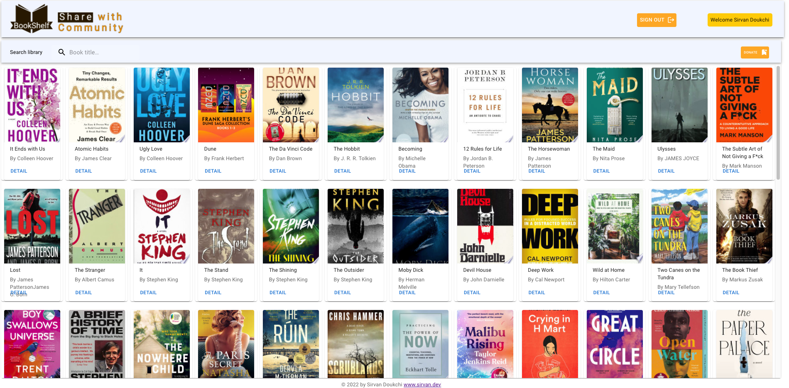

## BookShelf APP - a community library

### Fullstack, RESTful Responsive App Built by : MERN stack - ReactJS, Node.JS, Express, MongoDB <a href="https://bookshelf-client-six.vercel.app/"> Demo </a>

### Google Books API , Firebase authentication for User signup,Google signin and Material UI (MUI) for CSS.

### Frontend deployed on Vercel, Backend deployed on Heroku
#### FrontEnd respositary can be found <a href="https://github.com/SirvanD/Bookshelf-Client"> Here </a>

#### Current main features:

- Users signUp/login/log out by either creating new account or use Google account to sign in
- Users can lookup books in Google Books api and then Donate to our library.
- Users can search in the local library, filtering the books shown in the sidebar.
- Clicking on each book card (detail) will open a new modal with books details with the options of Borrow or Return depending on books availability.

### Application ScreenShot

